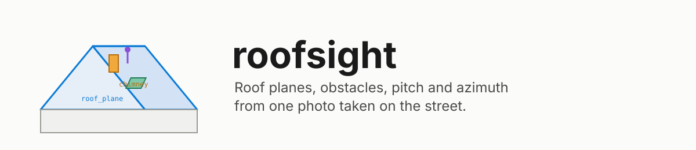

<p align="center">
  <picture>
    <source media="(prefers-color-scheme: dark)" srcset="docs/brand/banner-dark.svg">
    
  </picture>
</p>

<p align="center">
  <a href="https://github.com/bnymnDev/roofsight/actions/workflows/ci.yml"></a>
  <a href="https://github.com/bnymnDev/roofsight/actions/workflows/docs.yml"></a>
  <a href="#status"></a>
  
  
  <a href="LICENSE"></a>
  <a href="docs/dataset.md"></a>
</p>

<p align="center">
  <a href="#introducing-roofsight">Why</a> ·
  <a href="#60-seconds">Quick start</a> ·
  <a href="#the-categories-in-one-screen">Categories</a> ·
  <a href="#leaderboard">Leaderboard</a> ·
  <a href="#pitch-and-azimuth-on-the-phone">Geometry</a> ·
  <a href="#documentation">Docs</a>
</p>

---

## Introducing roofsight

An installer stands in front of a house with a phone. The question is simple: how many
modules fit on that roof, facing which way, at what pitch, and what is in the way. Today the
answer comes from a satellite tile that is three years old, sees the rear planes better than
the street-facing ones, and shows a chimney as four grey pixels. Or from a drone, a ladder,
or a second visit.

Roof segmentation datasets are aerial. Every one of them. The view an installer actually has,
from the pavement, looking up, with a tree in the way and the neighbour's roof behind, has no
public dataset, no benchmark and no model that runs on the phone in their hand.

**roofsight is that dataset, that benchmark and that model.** One ground-level smartphone photo
in; roof planes and rooftop obstacles as instance masks out, and with the phone's pose the
pitch and azimuth of every plane, on device, in the time it takes to lower the phone:

| | |
|---|---|
| **A dataset** | Ground-view photos of residential houses with instance masks for roof planes, chimneys, dormers, skylights, antennas, vents, snow guards, existing PV, vegetation occlusion and roof edges. COCO format, every image with its license and attribution, every annotation with its provenance. CC-BY-SA 4.0. |
| **A benchmark** | Fixed splits, a frozen test set, one command. Mask AP for the record; small-obstacle recall and roof-plane boundary F because a missed vent is a module you cannot place and a 3 px edge error is a row you cannot fit. Latency on CPU and on an iPhone. Pitch and azimuth error against ARKit ground truth. |
| **Models** | RF-DETR-Seg Nano and Small, fine-tuned, Apache-2.0, NMS-free. Shipped as PyTorch, ONNX and a Core ML `mlpackage` that is only released once it agrees with the PyTorch model to a mask IoU of 0.98. |
| **RoofGeometry** | A Swift package that turns masks, intrinsics and the phone's gravity and heading into pitch and azimuth per plane. Pure functions, `Sendable`, tested on synthetic roofs without a device. |

```
  street photo            roofsight model            RoofGeometry            PV planner
┌──────────────┐        ┌──────────────────┐       ┌────────────────┐      ┌───────────────┐
│  one JPEG    │───────▶│ roof_plane ×n    │──────▶│ pitch  35.2°   │─────▶│ module layout │
│  + ARKit     │        │ chimney, vent…   │       │ azimuth 187°   │      │ (not in here) │
│    pose      │        │ roof_edge (eave, │       │ eave, ridge 3D │      └───────────────┘
└──────────────┘        │   ridge, verge)  │       └────────────────┘
                        └──────────────────┘
```

No satellite tile as input. No drone. No second visit. The yield calculation, the module
layout and the shading simulation stay in the planning app; this repo ends at geometry.

---

## What's in the box

| | |
|---|---|
| **Ten categories, stable ids** | `roof_plane` and `roof_edge` for geometry, seven obstacle classes for layout, `tree_occlusion` for honesty. Ids never change; a new class is appended and bumps the dataset version. |
| **A dataset pipeline** | Mapillary API v4 by bounding box (perspective cameras only, quality-filtered), perceptual-hash dedupe, face and plate anonymization, a SAM 3 roof-presence filter, stratified splits by region and obstacle count. `roofsight data validate` refuses an image without a license, attribution or anonymization. |
| **SAM 3 auto-labeling** | Text prompts with synonyms per category, NMS across the synonyms, minimum areas, and roof planes split along fitted edge lines where SAM 3 merged neighbours. Review in FiftyOne; every annotation ends up `auto`, `auto_edited` or `manual`. SAM 3 never leaves `labeling/`. |
| **Metrics that matter for PV** | Small-obstacle recall at IoU 0.5 for instances under 32² px. Boundary F with 1 px tolerance at 640 px. Both with golden tests. Plus COCO mask AP per category, because reviewers ask. |
| **Reproducible runs** | Every train, eval and export writes `run.json`: git sha, config hash, dataset version, seed, hardware. The leaderboard is generated from those files and refuses anything without one. |
| **Core ML export with a gate** | PyTorch → ONNX (opset 17, static 640) → ML Program fp16 for the Neural Engine. `roofsight export verify` compares the backends on a held-out split and fails below 0.98 mask and box IoU. |
| **Pitch and azimuth from one view** | Eave and ridge are horizontal, so gravity pins their 3D direction; a verge or hip pins the slope. With LiDAR, a plane fit to the depth inside the mask replaces the line geometry and makes the eave metric. |
| **Paper-ready tables** | `roofsight leaderboard` writes `docs/leaderboard.md` and `paper/results.tex` from the same numbers. CI fails if either was edited by hand. |

---

## Who it is for

- **You install or plan PV** and want a first layout while still standing in front of the
  house, from the photo you were going to take anyway.
- **You build the planning app** and need a segmentation model that runs on the phone, a
  geometry layer you can test without a device, and a license you can ship.
- **You work on segmentation** and want a benchmark where small objects and boundaries are the
  point, not an afterthought, on a view no aerial dataset covers.
- **You have a phone and a street** and want to contribute the most valuable kind of image
  there is here: one with pose ground truth.

---

## 60 seconds

```sh
git clone https://github.com/bnymnDev/roofsight && cd roofsight
uv sync --group dev
uv run roofsight --help
```

**Run the model on a photo** (once the first release is out):

```sh
dvc pull datasets/v0.1.dvc                                        # dataset, CC-BY-SA 4.0
uv run roofsight predict --checkpoint RoofSight-small-v0.1.pth --image house.jpg --out house.json
```

**Evaluate a run and update the leaderboard:**

```sh
uv run roofsight train   --config configs/train/rfdetr-s.yaml
uv run roofsight predict --run runs/<id> --split test
uv run roofsight eval    --run runs/<id> --split test
uv run roofsight leaderboard
```

**Use the Core ML model in an app:**

```swift
let model = try RoofSight(configuration: MLModelConfiguration())   // from the .mlpackage
let output = try model.prediction(image: pixelBuffer)
```

**Turn masks into pitch and azimuth:**

```swift
import RoofGeometry

let estimator = RoofGeometryEstimator(
    intrinsics: ARKitBoundary.intrinsics(frame.camera.intrinsics, width: 1920, height: 1440),
    orientation: ARKitBoundary.orientation(cameraTransform: frame.camera.transform))

let plane = RoofPlaneObservation(id: 1, centroid: centroid,
                                 edges: [.init(type: .eave, points: eave),
                                         .init(type: .verge, points: verge)],
                                 depth: lidarSamples)                // optional
let roof = try estimator.estimate(plane)
roof.pitchDegrees      // 35.2
roof.azimuthDegrees    // 187, 0 = N, 90 = E
roof.confidence        // 0.91 with depth, ≤ 0.85 from lines alone
```

---

## The categories, in one screen

| id | name | what it is | why it is there |
|----|------|------------|-----------------|
| 1 | `roof_plane` | one instance per visible plane | the surface modules go on |
| 2 | `chimney` | | keep-out zone, shading |
| 3 | `dormer` | whole body including its roof | breaks the plane |
| 4 | `skylight` | roof windows, solar tubes | keep-out zone |
| 5 | `antenna` | dishes, aerials | keep-out zone, often removable |
| 6 | `vent` | pipes, stacks, hoods | small, easy to miss, cannot be moved |
| 7 | `snow_guard` | rails, hooks | row spacing |
| 8 | `existing_pv` | modules, solar thermal | what is already there |
| 9 | `tree_occlusion` | vegetation in front of roof | says "unknown", not "free" |
| 10 | `roof_edge` | thin mask; `edge_type` ∈ eave, ridge, hip, valley, verge | what geometry is computed from |

Every annotation carries `provenance`; every image carries `source`, `license` and
`attribution`. The full list with notes: [docs/dataset.md](docs/dataset.md).

---

## Leaderboard

Generated by `roofsight leaderboard` from `runs/`, never by hand. Mask AP, small-obstacle
recall and boundary F in %, latency as the median of 50 runs at 640 px.

<!-- BEGIN:leaderboard -->
| model | params | mask AP | small-obstacle recall | boundary F | CPU ms | iPhone ms | dataset | run id |
|---|---|---|---|---|---|---|---|---|
| _no runs yet_ | | | | | | | | |
<!-- END:leaderboard -->

Planned baselines: SAM 3 zero-shot with the labeling prompts (what you get for free),
YOLO26-seg n/s (reported, not shipped: AGPL), Mask2Former-Swin-T (accuracy reference). Live
table and submission rules: [docs/leaderboard.md](docs/leaderboard.md),
[docs/benchmark.md](docs/benchmark.md).

---

## Pitch and azimuth on the phone

A single photo has no depth. It does have gravity and a compass, and a roof has straight
edges with known roles:

1. Every 3D line that projects onto an image line lies in the plane through the camera
   center and that line. An eave is horizontal, so its 3D direction is the one vector
   perpendicular to both gravity and that plane's normal. A ridge works the same way.
2. A verge runs straight up the slope, perpendicular to the eave in plan; a hip bisects the
   corner. That fixes the horizontal part of the slope direction, and its own image line
   fixes the vertical part.
3. The plane normal is eave × slope. Pitch is its angle to up; azimuth the bearing of its
   horizontal part. Of the two mirror solutions, the one facing the camera is the visible face.
4. With LiDAR, a plane fit to the depth samples inside the mask replaces steps 2 and 3, and
   the eave and ridge come back as metric 3D lines.

On synthetic roofs rendered through a phone camera, `swift test` recovers pitch and azimuth to
within 0.05° from exact edges and within 2° with ±2 px noise on every sample. The real-world
number is the pitch/azimuth MAE on the own-photo subset of the benchmark. Method, frames and
limits: [docs/geometry.md](docs/geometry.md).

---

## Commands

<!-- BEGIN:commands -->
| Command | What it does |
|---|---|
| `data build --config <yaml>` | Download, dedupe, anonymize, roof-filter, split → `images.json` |
| `data validate <dataset>` | License, attribution, anonymization, category and file checks; exit 1 on any error |
| `data split <dataset>` | Print split sizes |
| `label --prompts <yaml> --in <dir> --out <dir> --checkpoint <sam3>` | SAM 3 auto-labels with provenance `auto` |
| `review <dataset> export\|import\|stats` | FiftyOne round trip; import sets `auto_edited` / `manual` |
| `train --config <yaml>` | Fine-tune RF-DETR-Seg; writes `runs/<id>/run.json` |
| `predict --run <dir> --split test` / `--checkpoint <pth> --image <jpg>` | COCO results JSON with RLE masks |
| `eval --run <dir> --split test` | Every metric on a split → `runs/<id>-eval/metrics.json` |
| `leaderboard` | Regenerate `docs/leaderboard.md` and `paper/results.tex` |
| `export coreml --run <dir>` | PyTorch → ONNX → Core ML ML Program, SHA256 alongside |
| `export verify <reference> <candidate>` | Backend agreement on the verify split; fails below 0.98 IoU |
<!-- END:commands -->

Configs: [`configs/data/v0.1.yaml`](configs/data/v0.1.yaml),
[`configs/labeling/prompts.yaml`](configs/labeling/prompts.yaml),
[`configs/train/rfdetr-n.yaml`](configs/train/rfdetr-n.yaml),
[`configs/train/rfdetr-s.yaml`](configs/train/rfdetr-s.yaml).

---

## Design principles

1. **The view the installer has.** Ground level, phone camera, looking up. Satellite and
   aerial imagery are never an input; they appear once, as the other side of the recall study.
2. **COCO, with our fields riding along.** Every viewer and every trainer reads the files
   unchanged. License, attribution, provenance and edge type are validated on our side.
3. **The metric is the use.** Small-obstacle recall and boundary F exist because AP does not
   feel a missed vent or a 3 px edge. Neither consumes predictions the way AP does; the
   question is whether the planner would have seen it.
4. **Nothing is typed by hand.** Leaderboard, results table and model card come from
   `run.json` and `metrics.json`. CI fails when they drift.
5. **Geometry needs two vectors, not a framework.** Down and north in the camera frame are
   all the estimator takes, so it runs on synthetic roofs in CI and on any pose source in
   production.
6. **Shippable licenses only.** Apache-2.0 code and weights, CC-BY-SA data, SAM 3 confined to
   labeling, AGPL models reported but never released.

The reasoning behind individual choices is in [docs/decisions.md](docs/decisions.md).

---

## Documentation

| Document | What is in it |
|---|---|
| [docs/dataset.md](docs/dataset.md) | Versions, categories, sources, licensing, the pipeline, how to contribute images |
| [docs/labeling.md](docs/labeling.md) | SAM 3 prompts, post-processing, FiftyOne review, provenance |
| [docs/benchmark.md](docs/benchmark.md) | Metrics and why, running and submitting, baselines |
| [docs/leaderboard.md](docs/leaderboard.md) | Generated from `runs/` |
| [docs/geometry.md](docs/geometry.md) | The estimator: input, output, method, accuracy, usage |
| [docs/model_card.md](docs/model_card.md) | The shipped models, intended use, limitations |
| [docs/decisions.md](docs/decisions.md) | Design decisions and the reasoning behind each |
| [SPEC.md](SPEC.md) | The v0.1 specification: goals, non-goals, milestones, open questions |
| [CONTRIBUTING.md](CONTRIBUTING.md) | Stack, layout, rules, commands, working style |
| [SECURITY.md](SECURITY.md) | How to report a vulnerability |

The same pages are built with MkDocs and published at
[bnymndev.github.io/roofsight](https://bnymndev.github.io/roofsight/) by the `docs` workflow.

---

## Building from source

```sh
uv sync --group dev
uv run ruff check . && uv run ruff format --check . && uv run mypy
uv run pytest                       # CPU, tiny fixtures, golden metric tests
uv run mkdocs serve                 # docs at http://127.0.0.1:8000

cd swift/RoofGeometry && swift test # synthetic gable and hip roofs, LiDAR plane fit, ARKit boundary
```

Training, labeling and export pull in the heavy dependencies as extras:
`uv sync --extra train`, `--extra label`, `--extra export`, or `--extra all`.

---

## Status

v0.1, milestone M1 in progress. Everything in this README that is code is implemented and
covered by tests: the dataset pipeline (offline, against a mocked Mapillary, and for real: the
first build pulled 1 418 anonymized frames from twelve NRW suburbs, SAM 3 kept 560 with a roof, manifest in git), the
labeling post-processing, every metric with golden tests, the export verification gate, the
leaderboard generator, and the geometry package on synthetic roofs. What does not exist yet:
reviewed labels, trained weights, a leaderboard row, and the `RoofGeometryBench` app target.
Those are the rest of M1–M3 in [SPEC.md](SPEC.md); labeling needs a SAM 3 checkpoint and the
weights need a GPU.

Not in it, on purpose: satellite or aerial input, yield and layout, multi-view reconstruction,
and training any foundation model.

## Citation

```bibtex
@misc{roofsight2026,
  title  = {RoofSight: Ground-View Roof and Rooftop-Obstacle Segmentation for On-Site PV Planning},
  author = {Ulupinar, B{\"u}nyamin},
  year   = {2026},
  url    = {https://github.com/bnymnDev/roofsight}
}
```

## License

Code and model weights: [Apache-2.0](LICENSE). Dataset: CC-BY-SA 4.0, with attribution to each
image's creator as recorded in the annotation file.

<p align="center"><sub>If roofsight saved you a ladder, a star helps the next installer find it.</sub></p>
